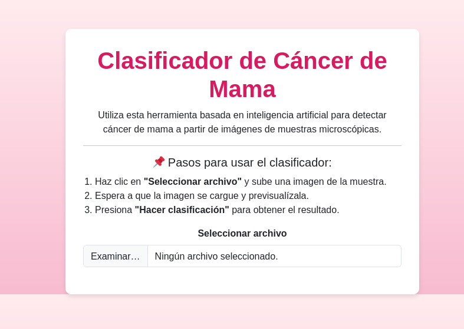
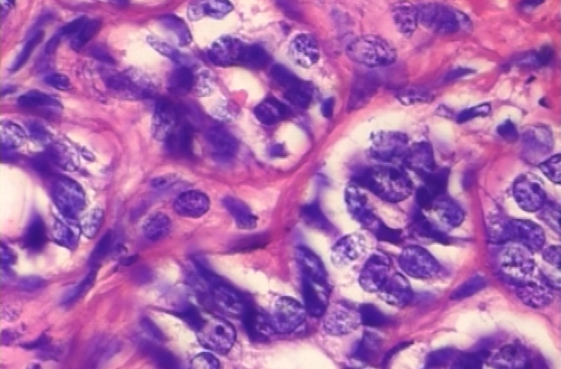
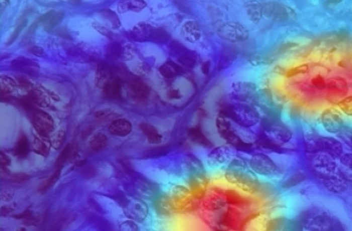

# Clasificador de Cáncer de Mama con Inteligencia Artificial

## 📌 Descripción
Este proyecto es una aplicación web que utiliza **redes neuronales profundas (CNN y DenseNet121)** para la detección de **cáncer de mama** a partir de imágenes histopatológicas.  
Permite a los usuarios subir imágenes de muestras microscópicas y obtener una **predicción automática** con un modelo de **Machine Learning**.  

La aplicación también muestra un **mapa de activación Grad-CAM**, resaltando las regiones más relevantes en la clasificación.

---

## 🔬 Características
✅ **Clasificación de imágenes de tejido mamario en benigno o maligno**.  
✅ **Interfaz intuitiva y fácil de usar**.  
✅ **Predicciones en tiempo real con Grad-CAM para visualizar zonas de atención del modelo**.  
✅ **Desarrollado con FastAPI para el backend y Bootstrap para el frontend**.  

---

## 🌍 Tecnologías Utilizadas
- **FastAPI** 🖥️ → Para crear la API backend.
- **TensorFlow/Keras** 🧠 → Para cargar y ejecutar el modelo de clasificación.
- **Grad-CAM** 🔥 → Para interpretar la clasificación del modelo.
- **JavaScript (Fetch API)** 📝 → Para conectar el frontend con la API.
- **Bootstrap 5** 🎨 → Para mejorar el diseño y la responsividad.

---

## 🚀 Cómo Usar la Aplicación
### 1️⃣ Subir una Imagen
- Haz clic en **"Seleccionar archivo"** y sube una imagen de una muestra histopatológica.

### 2️⃣ Hacer la Clasificación
- Presiona el botón **"🔍 Hacer clasificación"**.
- La IA procesará la imagen y mostrará el resultado.

### 3️⃣ Ver el Grad-CAM
- Se generará una imagen **destacando la región más relevante** utilizada por la IA para la predicción.

---

## 📷 Capturas de Pantalla
| Subida de Imagen  | Clasificación con Grad-CAM |
|-------------------|--------------------------|
|  |  |

