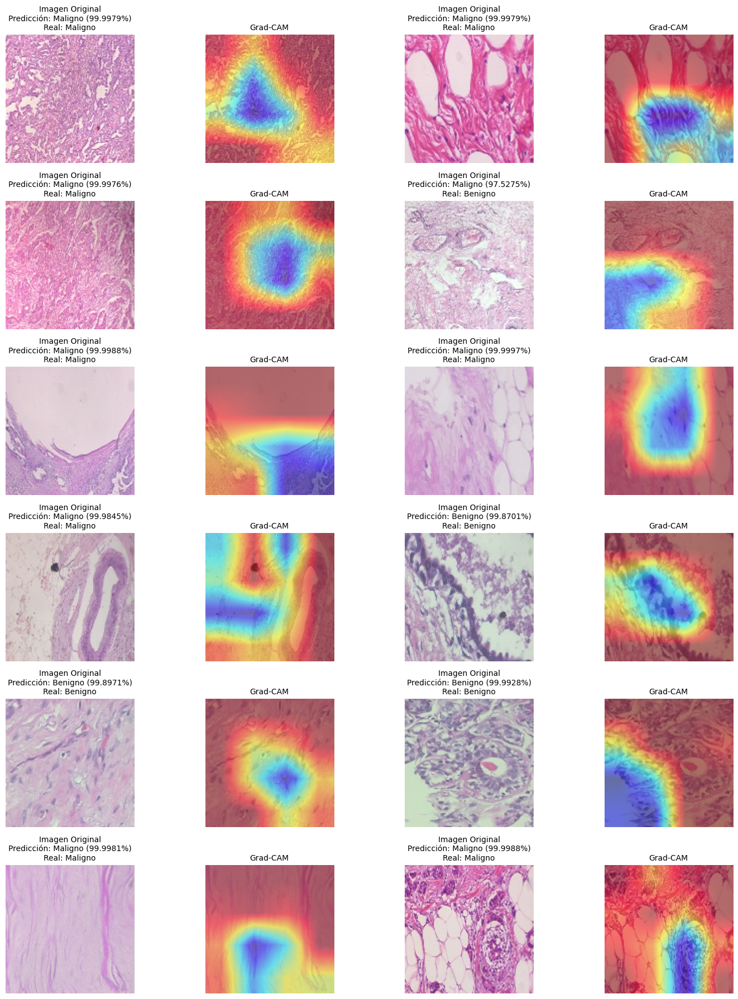

#  Proyecto - Detección de Cancer de Mama

[Frontend en Github pages](https://jrbeduardo.github.io/proyecto-cancer/)

## Entegrables:

1. [Memoria Técnica](dev_model/MEMORIA-TECNICA.md)
1. [Documentación API](app/documentacion-api.md)

## Contexto

El cáncer de mama es una de las principales causas de muerte en mujeres a nivel mundial. Su diagnóstico temprano es crucial para mejorar las tasas de supervivencia, permitiendo tratamientos menos invasivos y con mayor eficacia. La identificación de células malignas en imágenes histopatológicas es una tarea compleja que requiere experiencia especializada.

En este proyecto, se implementa un modelo de **red neuronal convolucional (CNN)** para la clasificación automática de imágenes histopatológicas de cáncer de mama. Se utiliza la base de datos **BreaKHis**, que contiene imágenes de tejido mamario con diferentes niveles de aumento (40X, 100X, 200X y 400X). Con el uso de aprendizaje profundo, se busca mejorar la precisión del diagnóstico y proporcionar herramientas de apoyo a especialistas médicos.

## Objetivo del Proyecto

El objetivo principal es desarrollar un modelo basado en **DenseNet121** y CNN convencionales para la clasificación de imágenes histopatológicas en **tumores benignos y malignos**. Además, se busca interpretar las predicciones del modelo mediante la técnica **Grad-CAM**, resaltando las regiones más relevantes para la clasificación.

## Descripción General del Conjunto de Datos

El conjunto de datos **BreaKHis** consiste en imágenes histopatológicas de tejido mamario teñidas y capturadas mediante microscopía. Se divide en dos clases principales:

- **Benigno**: Tumores no invasivos, con crecimiento lento y sin riesgo de metástasis.
- **Maligno**: Tumores cancerosos con capacidad de invadir otros tejidos y propagarse.

### 📌 **Características del Dataset**
- **Número de imágenes**: 7,909 imágenes en total.
- **Clases**: 2 (Benigno y Maligno).
- **Formatos**: PNG (700x460 píxeles, RGB).
- **Ampliaciones**: 40X, 100X, 200X, 400X.
- **Fuente**: Base de datos **BreaKHis**, desarrollada en colaboración con el P&D Laboratory – Pathological Anatomy and Cytopathology en Paraná, Brasil.

Este conjunto de datos permite entrenar modelos de **visión por computadora** para mejorar la precisión del diagnóstico automatizado de cáncer de mama.

## Implementación del Modelo

Se probaron dos enfoques principales:
1. **Modelo CNN Convencional**: Red convolucional con múltiples capas para extracción de características.
2. **Modelo basado en DenseNet121**: Uso de transferencia de aprendizaje y fusión de características intermedias para mejorar la precisión.

Además, se empleó **validación cruzada** para evaluar la robustez de los modelos y se utilizó la técnica **Grad-CAM** para interpretar sus predicciones.

## Enlaces Relevantes

- [Base de Datos BreaKHis](https://web.inf.ufpr.br/vri/databases/breast-cancer-histopathological-database-breakhis/)
- [Publicación sobre BreaKHis](https://doi.org/10.1109/IJCNN.2016.7727519)
