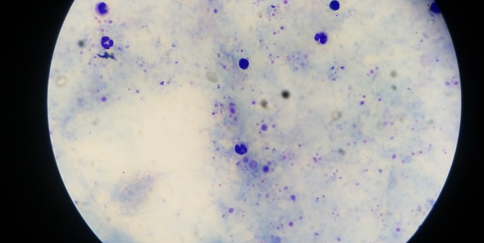

#  Proyecto - Detección de Malaria de Lacuna

[Video Demo](https://drive.google.com/file/d/1mvCmi2XkMpkig0v9X3u08-PVtwchd3Tc/view?usp=sharing)
[Frontend en Github pages](https://jrbeduardo.github.io/proyecto-malaria/)

## Integrantes:  

- Francisco Perez Carbajal
- Jose Eduardo Rodriguez Barrios

## Entegrables:

1. [Memoria Técnica](dev_model/MEMORIA-TECNICA.md)
1. [Documentación API](app/documentacion-api.md)

## Contexto

**Zindi** es una plataforma africana de competencias en ciencia de datos que reúne a una comunidad de científicos de datos, ingenieros, académicos, empresas, ONG, gobiernos e instituciones para abordar los desafíos más apremiantes del continente mediante el uso de inteligencia artificial y aprendizaje automático.

El **Desafío de Detección de Malaria de Lacuna** es una competencia organizada por Zindi que busca desarrollar modelos de visión por computadora para identificar parásitos y células sanguíneas en imágenes microscópicas de pacientes con malaria. La malaria es una de las enfermedades infecciosas más mortales del mundo, responsable de cientos de miles de muertes anualmente, especialmente en África, afectando predominantemente a niños menores de cinco años y mujeres embarazadas.

## Objetivo del Proyecto

El objetivo principal es crear un modelo que pueda categorizar con precisión parásitos y células sanguíneas en imágenes microscópicas, facilitando un diagnóstico rápido y preciso de la malaria en entornos con recursos limitados.

## Descripción General del Conjunto de Datos

El **frotis de sangre** es un procedimiento diagnóstico utilizado en medicina para analizar las células presentes en la sangre. Consiste en extender una gota de sangre sobre un portaobjetos de vidrio, creando una capa delgada que se tiñe y se examina bajo un microscopio. Este análisis permite observar la forma, tamaño y características de los glóbulos rojos, glóbulos blancos y plaquetas, siendo una herramienta clave para diagnosticar diversas enfermedades.

 

- **Imágenes**: Frotis de sangre teñidos capturados mediante microscopía, mostrando células infectadas y no infectadas por el parásito de la malaria.
- **Etiquetas**: Cada imagen está etiquetada para indicar la presencia o ausencia de infección por malaria.
- **Formato**: Las imágenes están en formato JPEG, facilitando su manejo y procesamiento.
- **Tamaño**: El conjunto de datos incluye un número significativo de imágenes, proporcionando una base sólida para el entrenamiento de modelos de aprendizaje profundo.

Este proyecto representa una oportunidad para contribuir al avance de soluciones tecnológicas en la lucha contra la malaria, mejorando la precisión y rapidez en su detección.

## Enlaces Relevantes

- [Conjunto de Datos para la Detección de Malaria de Lacuna en Kaggle](https://www.kaggle.com/datasets/rajsahu2004/lacuna-malaria-detection-dataset)
- [Desafío de Detección de Malaria de Lacuna en Zindi](https://zindi.africa/competitions/lacuna-malaria-detection-challenge)