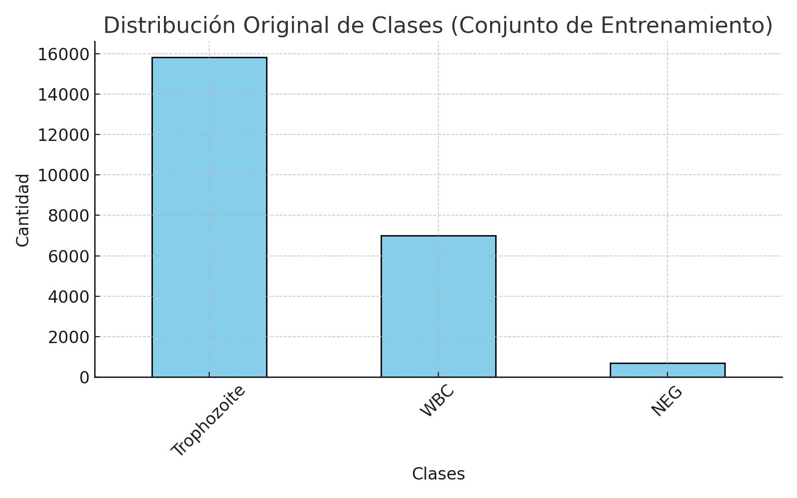
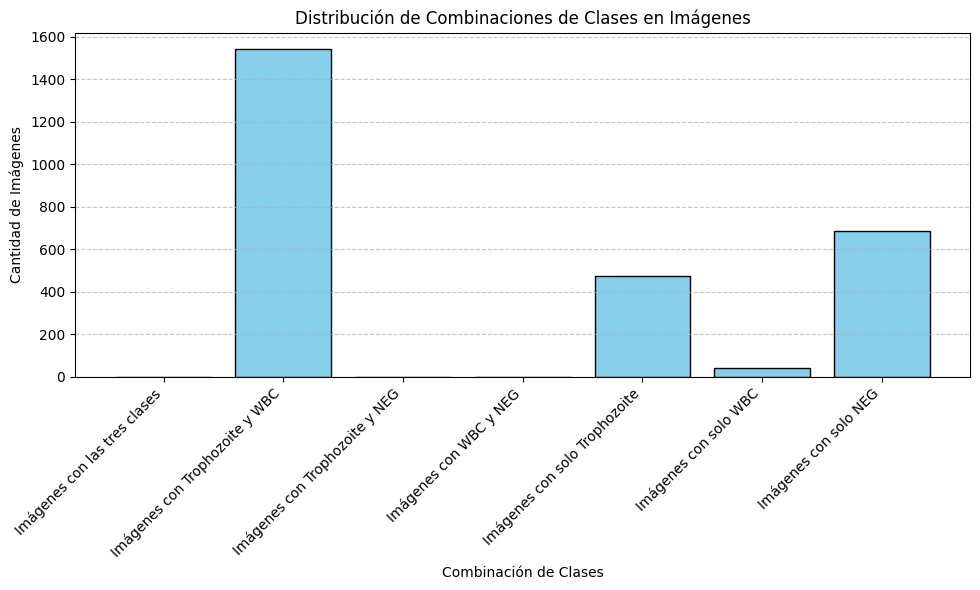
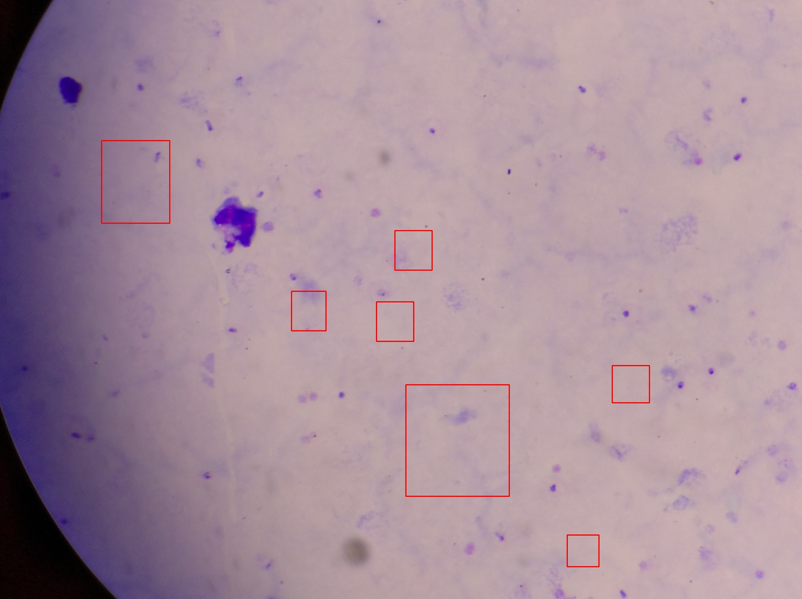
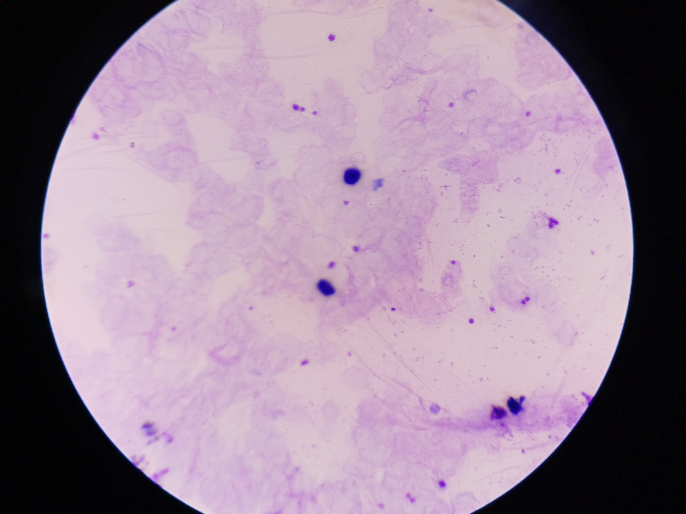
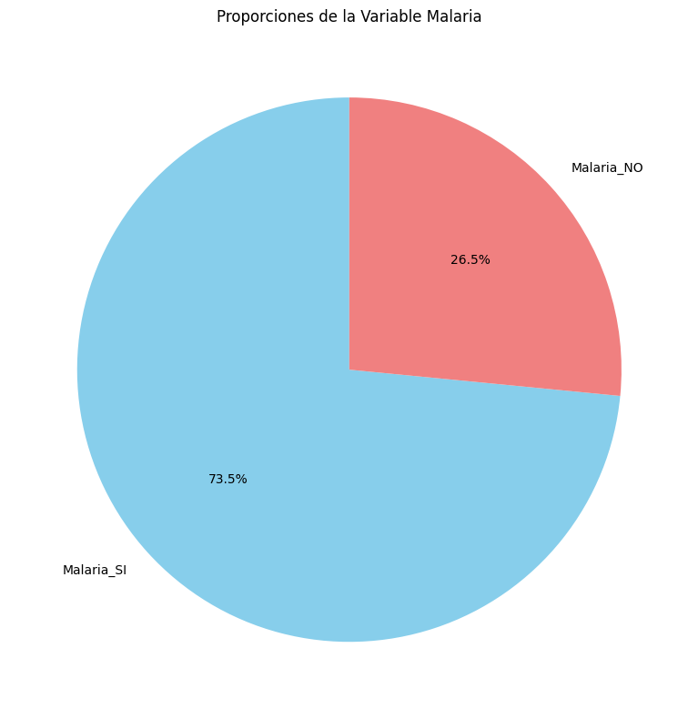
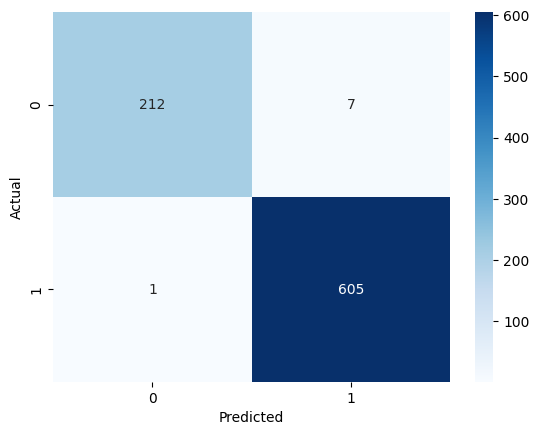

# Memoria Técnica

## Portada
- **Nombre del Proyecto**: Clasificador de Malaria
- **Fecha**: 21 de noviembre de 2024.
- **Integrantes**:  
  - Francisco Perez Carbajal
  - Jose Eduardo Rodriguez Barrios

## Índice
- [Portada](#portada)
- [Alcance del proyecto](#alcance-del-proyecto)
  - [Objetivo](#objetivo)
  - [Introducción](#introducción)
- [Fuentes de información y procedimientos aplicados](#fuentes-de-información-y-procedimientos-aplicados)
  - [Construcción del modelo](#construcción-del-modelo)
  - [Resultados modelo](#resultados-modelo)
  - [Pruebas sobre el modelo](#pruebas-sobre-el-modelo)
  - [Conclusiones](#conclusiones)
- [Conclusiones generales](#conclusiones-generales)
- [Anexos](#anexos)
- [Glosario](#glosario)

## Alcance del proyecto

### Objetivo
El objetivo de este proyecto es clasificar imágenes de células sanguíneas en dos categorías:
1. **Con malaria (Label = MALARIA_SI):** Imágenes que contienen al menos un trofozoíto.
2. **Sin malaria (Label = MALARIA_NO):** Imágenes que no contienen trofozoítos.

### Introducción
La malaria es una enfermedad potencialmente mortal causada por parásitos del género *Plasmodium* y transmitida por la picadura de mosquitos infectados. El diagnóstico temprano y preciso es crucial para garantizar un tratamiento oportuno y prevenir complicaciones graves. Tradicionalmente, el diagnóstico se realiza mediante la observación manual de frotis sanguíneos teñidos bajo un microscopio, un proceso que requiere tiempo y experiencia técnica. 

En este contexto, los avances en inteligencia artificial, específicamente en **deeplearning**, han abierto nuevas oportunidades para automatizar y mejorar la precisión del diagnóstico. Este proyecto utiliza una **Red Neuronal Convolucional (CNN)**, una arquitectura especializada en procesar datos visuales, para construir un clasificador de imágenes que detecte automáticamente la malaria en imágenes de frotis sanguíneos.

## Fuentes de información y procedimientos aplicados

El conjunto de datos, descargado de Kaggle, pertenece al dominio de detección de malaria mediante imágenes de células sanguíneas. Este conjunto de datos esta compuesto por los siguientes archivos y carpetas:

- **images**.
Este directorio contiene las imágenes utilizadas para la tarea de clasificación. Incluye imágenes de células sanguíneas infectadas y no infectadas por malaria.

- **SampleSubmission.csv**.
Este archivo es un ejemplo del formato esperado para las predicciones de clasificación.

- **Test.csv**.
Contiene información sobre las imágenes de prueba. 

- **Train.csv**.
Este archivo contiene los datos de entrenamiento, que son una lista de imágenes junto con sus etiquetas correspondientes. 

  - **Columnas:**
    - `Image_ID`: Identificador único de las imágenes.
    - `class`: Clase de la imagen (e.g., Trophozoite, NEG para negativos).
    - `confidence`: Confianza asociada (en este caso, siempre 1.0).
    - `ymin`, `xmin`, `ymax`, `xmax`: Coordenadas de un cuadro delimitador (bounding box) para objetos relevantes en la imagen.

  - **Cantidad de filas:** 23,530 entradas, pero solo 2,747 imágenes únicas (indicando múltiples objetos por imagen).

### Distribución de Clases en Train.csv

La gráfica a continuación muestra la distribución de las clases en el conjunto de entrenamiento:

### Observaciones:
- `Trophozoite` tiene la mayoría de los registros.
- Las otras clases, `NEG` y `WBC`, tienen menos ejemplos en comparación.
- Combinaciones: 
  - No hay imágenes que contengan las tres clases simultáneamente.
  - La combinación más común es Trophozoite y WBC, mientras que no hay combinaciones que incluyan NEG con otra clase.
  - Una proporción significativa de imágenes tiene solo una clase (Trophozoite, WBC, o NEG).

## Ejemplo de Imágenes con Bounding Boxes

Los **bounding box coordinates** son valores que definen un rectángulo alrededor de un objeto de interés dentro de una imagen. Este rectángulo se utiliza comúnmente en tareas de visión por computadora, como la detección de objetos, para localizar y delimitar objetos específicos dentro de una imagen.

Las imágenes a continuación muestran ejemplos del conjunto de datos con sus respectivas bounding boxes dibujadas.

### Ejemplo 1: Imagen `id_q18tfhfneh.jpg`

### Ejemplo 2: Imagen `id_zz4ga0557e.jpg`

### Ejemplo 3: Imagen `id_2pye2ftpl6.jpg`

---

## Pipeline de Preparación
### 1. Crear Etiquetas Binarias
- Clasificamos las imágenes basándonos en si contienen al menos un trofozoíto.
  
### 2. División del Conjunto de Datos
- Los datos se dividen en entrenamiento y validación con proporciones del 80% y 20% respectivamente.

  | Conjunto         | Cantidad de Imágenes |
  |-------------------|----------------------|
  | Entrenamiento     | 2,197               |
  | Validación        | 550                 |
  

  - **Total de imágenes:** 2,747
  - **Etiquetas:**
    - **malaria_SI:** 2,018 imágenes
    - **malaria_NO:** 729 imágenes

### 3. Preprocesamiento
Antes de usar las imágenes, se realiza un escalado de sus píxeles para mejorar el rendimiento del modelo:
- **Escalado:** Los valores de los píxeles se convierten de `[0, 255]` a `[0, 1]`.

### 4. Manejo de desequilibrio entre clases
Cuando una clase tiene más ejemplos que otra, el modelo puede inclinarse a favorecer la clase más frecuente. Para evitarlo:

1. Se calculan pesos de clase que equilibran la importancia de ambas clases.
2. Estos pesospenalizan al modelo por cometer errores en la clase menos representada.

---

## Construcción del modelo

La red que construiremos se basa en una arquitectura de **red neuronal convolucional (CNN)**, una técnica ideal para problemas de visión por computadora. Las CNNs son capaces de extraer características clave de las imágenes, como texturas, bordes y patrones complejos, que son esenciales para identificar trofozoítos, glóbulos blancos y otras estructuras relevantes en las imágenes de microscopio.

### Aquitectura

| **Layer (type)**           | **Output Shape**         | **Param #** |
|----------------------------|--------------------------|-------------|
| `input_1 (InputLayer)`     | (None, 224, 224, 3)     | 0           |
| `conv2d (Conv2D)`          | (None, 222, 222, 32)    | 896         |
| `max_pooling2d (MaxPooling2D)` | (None, 111, 111, 32)    | 0           |
| `conv2d_1 (Conv2D)`        | (None, 109, 109, 32)    | 9,248       |
| `max_pooling2d_1 (MaxPooling2D)` | (None, 54, 54, 32)     | 0           |
| `conv2d_2 (Conv2D)`        | (None, 52, 52, 64)      | 18,496      |
| `flatten (Flatten)`        | (None, 173056)          | 0           |
| `dense (Dense)`            | (None, 128)             | 22,151,136  |
| `dense_1 (Dense)`          | (None, 1)               | 129         |

#### **Totales**
- **Total params:** 22,179,905
- **Trainable params:** 22,179,905
- **Non-trainable params:** 0

### Funcionamiento del Modelo
1. Las imágenes se pasan a través de tres capas convolucionales para extraer características espaciales.
1. Las capas de MaxPooling reducen las dimensiones de las características.
1. La capa de Flatten transforma los datos en un vector plano.
1. Las capas densas realizan la clasificación basada en las características extraídas.
1. Capa de salida. Una sola neurona con una función de activación sigmoide produce una probabilidad entre 0 y 1, indicando si la imagen pertenece a la clase positiva (`Malaria_SI`).

### Justificación 

Esta red es adecuada para la tarea de clasificación de malaria porque:

- Extrae características relevantes de las imágenes.
- Reduce la dimensionalidad de manera eficiente.
- Se adapta bien a problemas de clasificación binaria.
- Tiene una estructura simple y eficiente que puede ser mejorada según las necesidades del problema.

## Resultados modelo

El modelo no muestra signos claros de sobreajuste, ya que las métricas de validación son similares a las de entrenamiento.

### **Precisión (Accuracy)**:

  - **Entrenamiento**: La precisión alcanza valores cercanos a 1.0 rápidamente, indicando un ajuste muy bueno a los datos de entrenamiento.
  - **Validación**: La precisión de validación es alta (~0.97-0.99), pero muestra ligeras oscilaciones en algunas épocas, lo que puede deberse a variaciones en los datos o a la falta de estabilidad.

### **Pérdida (Loss)**:

- **Entrenamiento**: La pérdida disminuye consistentemente y se estabiliza en valores muy bajos (~0.01), lo que refleja que el modelo está aprendiendo adecuadamente.
- **Validación**: La pérdida de validación es baja, pero fluctúa ligeramente a partir de la mitad del entrenamiento, lo que sugiere que el modelo podría beneficiarse de técnicas adicionales de regularización para mayor estabilidad.
 

## Pruebas sobre el modelo

### **Matriz de Confusión**

## **Métricas de Evaluación**

### **1. Precisión (Precision)**
De todas las predicciones como "Malaria", el 98.9% fueron correctas. Una alta precisión significa que el modelo tiene una baja tasa de falsos positivos

## **2. Recall (Sensibilidad)**

El modelo identificó correctamente el 99.8% de los casos de malaria. Esto es crucial en diagnósticos médicos, ya que minimiza los casos de malaria no detectados.

## **3. F1-Score**

Un F1-Score de 0.994 indica un balance excelente entre precisión y recall, lo que demuestra que el modelo es confiable y robusto para detectar malaria.

## Conclusiones

- El modelo tiene un excelente desempeño tanto en entrenamiento como en validación, y parece generalizar bien. Las oscilaciones en las métricas pueden abordarse con pequeños ajustes, pero no afectan significativamente el rendimiento general.

- El modelo es altamente efectivo para detectar malaria en imágenes, con métricas que reflejan una excelente precisión y sensibilidad. Este rendimiento lo hace adecuado para aplicaciones en entornos clínicos, donde el diagnóstico rápido y preciso es crucial.

## Conclusiones generales

El clasificador de malaria basado en redes neuronales convolucionales representa un paso significativo hacia la automatización del diagnóstico médico. Con un desempeño excelente y un diseño escalable, este modelo tiene el potencial de salvar vidas y mejorar la calidad del diagnóstico en regiones donde la malaria sigue siendo un desafío crítico para la salud pública.

Este proyecto demuestra cómo la inteligencia artificial puede transformar la forma en que se aborda el diagnóstico médico:

- **Rápido y Preciso:** El modelo proporciona resultados en tiempo real, lo que podría acelerar la detección de malaria en áreas rurales y urbanas.
- **Económico:** Al automatizar el proceso, se reduce la necesidad de personal altamente capacitado, haciéndolo accesible para hospitales y laboratorios con recursos limitados.
- **Escalable:** La solución puede adaptarse a otros problemas médicos relacionados con imágenes, como la detección de otras enfermedades infecciosas.

## Anexos
- [Repositorio Github](https://github.com/jrbeduardo/proyecto-malaria)
- [Conjunto de Datos para la Detección de Malaria de Lacuna en Kaggle](https://www.kaggle.com/datasets/rajsahu2004/lacuna-malaria-detection-dataset)
- [Desafío de Detección de Malaria de Lacuna en Zindi](https://zindi.africa/competitions/lacuna-malaria-detection-challenge)

## Glosario

Este glosario proporciona una breve descripción de los términos biológicos relacionados con la detección de malaria utilizados en el proyecto.

### **1. Malaria**
- **Definición:** Enfermedad infecciosa causada por parásitos del género *Plasmodium*, transmitida principalmente por la picadura de mosquitos hembra del género *Anopheles*.
- **Importancia:** Es una de las enfermedades infecciosas más prevalentes, afectando millones de personas cada año.

### **2. Trofozoíto**
- **Definición:** Etapa activa de alimentación y crecimiento del parásito *Plasmodium* dentro de los glóbulos rojos.
- **Relevancia:** La presencia de trofozoítos en una muestra de sangre es un indicador clave de infección por malaria.

### **3. Glóbulos Rojos (Eritrocitos)**
- **Definición:** Células sanguíneas responsables de transportar oxígeno a través del cuerpo.
- **Relación con la malaria:** El parásito *Plasmodium* invade y se desarrolla dentro de los glóbulos rojos.

### **4. Glóbulos Blancos (Leucocitos)**
- **Definición:** Células del sistema inmunitario que protegen al cuerpo contra infecciones.
- **Relevancia:** Aunque no están infectados por el parásito de la malaria, pueden aparecer en las imágenes de microscopio y deben diferenciarse de los trofozoítos.

### **5. Esquizonte**
- **Definición:** Etapa de multiplicación del parásito *Plasmodium* dentro de los glóbulos rojos.
- **Importancia:** La detección de esquizontes puede ayudar a determinar la gravedad de la infección.

### **6. Gametocito**
- **Definición:** Etapa del parásito *Plasmodium* que es transmitida al mosquito durante la picadura.
- **Relevancia:** Aunque no es directamente responsable de los síntomas, su presencia indica que el parásito puede propagarse.

### **7. Plasmodium**
- **Definición:** Género de parásitos protozoarios que causan la malaria. Las especies más comunes son:
  - *Plasmodium falciparum*: Responsable de la mayoría de los casos graves de malaria.
  - *Plasmodium vivax*: Causa una forma recurrente de malaria.
  - *Plasmodium malariae*: Asociado con infecciones crónicas.
  - *Plasmodium ovale*: Rara, pero también causa recurrencias.
  - *Plasmodium knowlesi*: Zoonótica, transmitida principalmente de macacos.

### **8. Frotis Sanguíneo**
- **Definición:** Técnica de laboratorio en la que una muestra de sangre se extiende sobre un portaobjetos y se tiñe para examinarla bajo un microscopio.
- **Uso en la malaria:** Es el método estándar para detectar y cuantificar parásitos de la malaria.

### **9. Tinción de Giemsa**
- **Definición:** Método de tinción utilizado para resaltar los parásitos en los glóbulos rojos durante un examen microscópico.
- **Importancia:** Ayuda a diferenciar entre las etapas del parásito *Plasmodium* y otras estructuras celulares.

### **10. Parasitología**
- **Definición:** Rama de la biología que estudia los parásitos y sus interacciones con los hospedadores.
- **Relevancia:** Es la base científica para el diagnóstico y tratamiento de la malaria.

